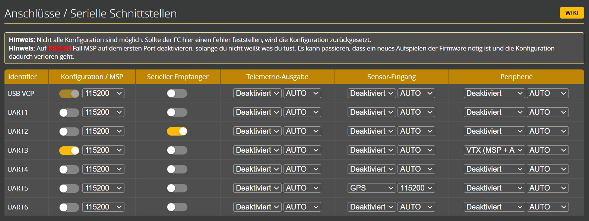

# Flywoo Explorer LR4
## Platform
https://flywoo.net/products/explorer-lr-4-o4-sub250-4k-1080p-micro-long-range
## Firmware
### Betaflight

### INav
https://www.google.com/search?q=flywoo+lr4+flash+inav&sca_esv=50bc830c1331a679&sxsrf=AE3TifMJMcvnRHZ5xAXFjIFl6uuLajU_7A%3A1761494442255&ei=qkX-aNGoD_fsi-gPr4Py8Q0&ved=0ahUKEwjRpYSUnsKQAxV39gIHHa-BPN4Q4dUDCBA&uact=5&oq=flywoo+lr4+flash+inav&gs_lp=Egxnd3Mtd2l6LXNlcnAiFWZseXdvbyBscjQgZmxhc2ggaW5hdkiFFFC6CFj_EnABeACQAQCYAbwCoAGSCaoBBzAuNS4wLjG4AQPIAQD4AQGYAgGgAgXCAgsQABiABBiwAxiiBMICCBAAGLADGO8FmAMAiAYBkAYDkgcBMaAHhwiyBwC4BwDCBwMyLTHIBwM&sclient=gws-wiz-serp#fpstate=ive&vld=cid:aa3059d0,vid:Xhssxug1I7o,st:0
#### PID
https://www.google.com/search?q=flywoo+lr4+inav+4&oq=flywoo+lr4+inav+4&gs_lcrp=EgRlZGdlKgYIABBFGDkyBggAEEUYOTIICAEQABgWGB4yBwgCEAAY7wUyCggDEAAYgAQYogQyCggEEAAYgAQYogQyCggFEAAYgAQYogQyCggGEAAYgAQYogTSAQg5OTg5ajBqMagCALACAA&sourceid=chrome&ie=UTF-8#fpstate=ive&vld=cid:1f2ea472,vid:mIJXFq8ZkqU,st:0

